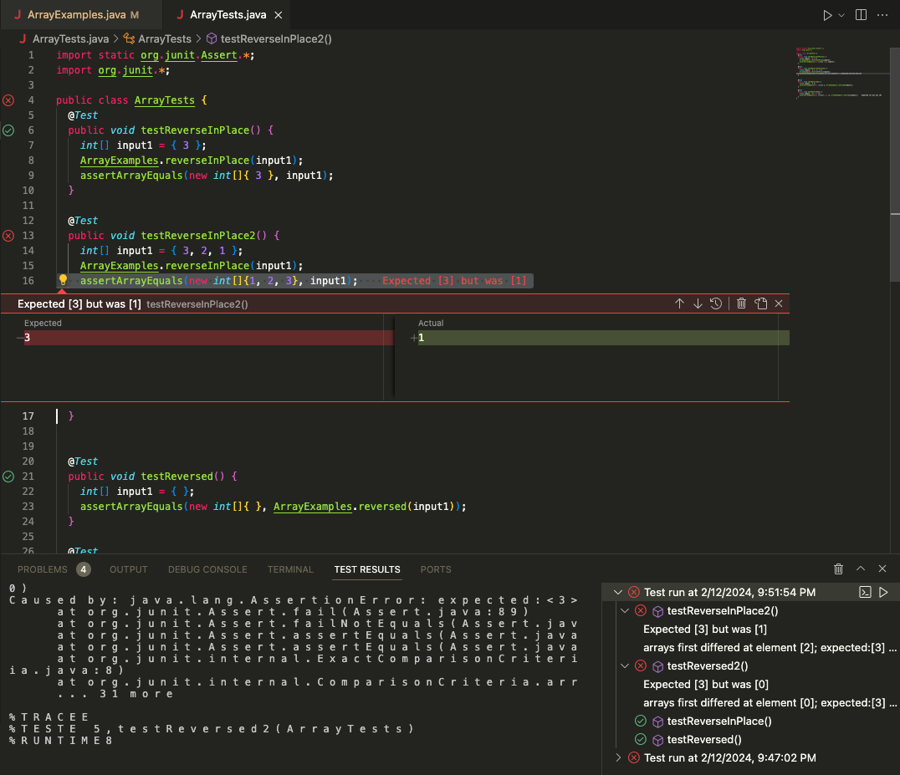

# Lab 3: Bugs and Commands (Week 5)
Caitlin McCallum
## Part 1: Bugs

### Failure Inducing Input

#### i. Junit - ArrayTests.java
```
  @Test 
	public void testReverseInPlace2() {
    int[] input1 = { 3, 2, 1 };
    ArrayExamples.reverseInPlace(input1);
    assertArrayEquals(new int[]{1, 2, 3}, input1);
}
```
#### ii. Associated Code - ArrayExamples.java
```
    1   static void reverseInPlace(int[] arr) {
    2       for(int i = 0; i < arr.length; i += 1) {
    3           arr[i] = arr[arr.length - i - 1];
    4       }
    5   }
```
### Successful Input
#### i. Junit - ArrayTests.java
```
@Test 
	public void testReverseInPlace() {
    int[] input1 = { 3 };
    ArrayExamples.reverseInPlace(input1);
    assertArrayEquals(new int[]{ 3 }, input1);
	}
 ```
#### ii. Associated Code - ArrayExamples.java
```
    1   static void reverseInPlace(int[] arr) {
    2       for(int i = 0; i < arr.length; i += 1) {
    3           arr[i] = arr[arr.length - i - 1];
    4       }
    5   }
```
### The Symptom


### The Bug
#### Code Before: 
```
    1   static void reverseInPlace(int[] arr) {
    2	    for(int i = 0; i < arr.length; i += 1) {
    3	        arr[i] = arr[arr.length - i - 1];
    4	}
```
#### Code After: 
```
    1   static void reverseInPlace(int[] arr) {
    2	    int[] tempArray = new int[arr.length];
    3	    for(int i = 0; i < arr.length; i += 1) {
    4	        tempArray[i] = arr[arr.length - i - 1];
    5	    }
    6	    for(int i = 0; i < arr.length; i += 1) {
    7	        arr[i] = tempArray[i];
    8	    }
    9   }   
```
Fixes: During the initial for loop on line 3, the element to be reversed is placed in a new array `tempArray`, then copied back over to the original array in the second for loop on line 6 in order to not overwrite the elements.

## Part 2: Researching the Grep Command
### `-i`: Ignore Case
#### Example 1:
```
Caitlins-MBP:Media caitimccallum$ grep 'legal'  Farm_workers.txt 
Caitlins-MBP:Media caitimccallum$ grep -i 'legal' Farm_workers.txt
Report: Farm workers plagued by pesticides Legal aid group
A new study by Colorado Legal Services, the first of its kind in
Nevertheless, Chavez took her case to Colorado Legal Services, a
Legal Services, which reports that migrant workers at farms
Legal Services conducted interviews with 88 farm workers in some
Kimi Jackson, author of the Colorado Legal Services study, said
Yet the Legal Services report faults growers, farm-labor
Chavez said she called Colorado Legal Services because she felt
Caitlins-MBP:Media caitimccallum$
```
In this code block, I use the command line option `-i` for grep in order to display all instances of the word "legal" regardless of case. As shown, when I ran the grep command without the `-i` command line option, there was no match found for "legal" in the file since it only appears as "Legal". This could be particularly useful for ensuring that all instances of a keyword are found, regrdless of case, which is beneficial when the case usage of the word is inconsistent or unknown. 

source: https://docs.rackspace.com/docs/use-the-linux-grep-command
#### Example 2:
```
Caitlins-MBP:Media caitimccallum$ grep 'poor' Advocate_for_Poor.txt 
helping East New York's poor, he's getting booted from the bodega
helping the working poor navigate the legal system. Immigration,
Caitlins-MBP:Media caitimccallum$ grep -i 'poor' Advocate_for_Poor.txt 
Advocate for Poor Has Own Obstacles
helping East New York's poor, he's getting booted from the bodega
helping the working poor navigate the legal system. Immigration,
Caitlins-MBP:Media caitimccallum$ 
```
In this example two variations of the grep command are executed to search for the term "poor" within the file `Advocate_for_Poor.txt.`. The command `grep 'poor' Advocate_for_Poor.txt` performs a case-sensitive search for the word "poor" within the specified file. It returns lines where "poor" appears exactly as typed, in lowercase. The command `grep -i 'poor' Advocate_for_Poor.txt` modifies the search to be case-insensitive, allowing for the detection of "poor" in any combination of uppercase and lowercase letters. This command shows additional instances where "Poor" is capitalized. The initial search missed this occurrence due to its case-sensitive limitation. The inclusion of `-i` in the second command highlights its utility in ensuring comprehensive search results, especially useful when the capitalization of keywords may vary throughout the document which may occur when attempting to capture the title or heading of the document in the search.

source: https://docs.rackspace.com/docs/use-the-linux-grep-command
### `-c`: Print Number of Line Matches
#### Example 1:
```
Caitlins-MBP:Media caitimccallum$ grep -c 'legal' Farm_workers.txt
0
Caitlins-MBP:Media caitimccallum$ grep -ci 'legal' Farm_workers.txt
8
```
In this code block, two grep commands are executed with different options to search for the term "legal" within the file Farm_workers.txt. The command `grep -c 'legal' Farm_workers.txt` uses the `-c` option with grep to count the number of lines that contain the exact word "legal" in a case-sensitive manner. The output, 0, indicates that there are no lines in Farm_workers.txt where "legal" appears in lowercase. The command `grep -ci 'legal' Farm_workers.txt` performs a case-insensitive search, counting occurrences of "legal" regardless of case by incorporating the `-i` option along with `-c`. The output, 8, reveals that there are eight instances within the file where "legal" appears, when not restricted by case sensitivity. This approach demonstrates the effectiveness of using `-c` to provide a consise method to quantify how many times a specified term appears in a document without manually reviewing each instance.

source: https://docs.rackspace.com/docs/use-the-linux-grep-command
#### Example 2:
```
Caitlins-MBP:Media caitimccallum$ grep -c 'a' A_helping_hand.txt 
119
```
In this code block, the grep command is used with the `-c` option to search for the letter "a" within the file A_helping_hand.txt. The command `grep -c 'a' A_helping_hand.txt` instructs grep to count the number of lines that contain at least one occurrence of the letter "a" by applying the `-c` option. The output, 119, indicates that the letter "a" appears in 119 lines of the `file A_helping_hand.txt`. This method is particularly useful when dealing with simple but frequently occurring elements, such as common words or letters, in a document. Rather than generating an overwhelming list of lines and manually counting each occurrence, the `-c` option simplifies the process by providing a direct count.

source: https://docs.rackspace.com/docs/use-the-linux-grep-command
### `-r`: Recursive Search
#### Example 1: 
```
Caitlins-MBP:government caitimccallum$ grep -r 'California' Media/
Media//water_fees.txt:result, Chris Schneider, executive director of Central California
Media//Legal-aid_chief.txt:California.
Media//Unusual_Woodburn.txt:by California Rural Legal Assistance. Irma Luna, a community worker
Media//Unusual_Woodburn.txt:Studies in California show that most Mixtecs follow the tomato,
Media//Few_who_need.txt:California Bar Journal
Media//Few_who_need.txt:California lags far behind comparable states in funding legal
Media//Few_who_need.txt:the California Commission on Access to Justice, which also found
Media//Few_who_need.txt:California has the highest number of people in poverty in the
Media//Few_who_need.txt:poor jumped 30 percent, occurred in California, and nearly 25
Media//Few_who_need.txt:Even those with jobs are suffering: 26 percent of California
Media//Few_who_need.txt:Justice in California," examined how the legal needs of the state's
Media//Few_who_need.txt:California to meet the poor's legal needs, Connecticut and
Media//Few_who_need.txt:from two to 14 times more proportionately than California, despite
Media//Few_who_need.txt:the fact that California has the world's sixth largest economy.
Media//Few_who_need.txt:the legal needs of low-income Californians.
Media//Few_who_need.txt:every 10,000 poor Californians. Despite this bleak picture, the
Media//Few_who_need.txt:injustice," observed Justice Earl Johnson of the California Court
Media//Few_who_need.txt:denied," said Londen. "Clearly, California can - and must - do
Media//Nonprofit_Buys.txt:California Rural Legal Assistance has purchased an Oxnard
Media//Nonprofit_Buys.txt:signals California Rural Legal Assistance's intention to establish
Media//Nonprofit_Buys.txt:Latino to serve on the California Supreme Court.
Media//Nonprofit_Buys.txt:California Rural Legal Assistance has provided legal services to
Media//Nonprofit_Buys.txt:California Rural Legal Assistance operations.
Media//Legal_hotline.txt:California, was the only California application from 24 submitted
Media//Legal_hotline.txt:screw-up in Washington that California is losing having a program
Media//Legal_hotline.txt:Northern California.
Media//Legal_hotline.txt:Chisorom Okwuosa, legal services developer for the California
Media//Workers_aid_center.txt:California. It will provide brochures, form letters seeking back
Media//Working_for_Free.txt:The State Bar of California presented Zucker with its 2002
Media//Kiosks_for_court_forms.txt:A University of California, Irvine, study released Wednesday
Media//Kiosks_for_court_forms.txt:should clear the way for expansion throughout California. Locally,
Media//Kiosks_for_court_forms.txt:Bonnie Hough, supervising attorney for the California Judicial
Media//Coup_Reshapes_Legal_Aid.txt:multimillion-dollar grant from the California Endowment to fund a
Media//Lockyer_Warns.txt:State Atty. Gen. Bill Lockyer is warning Californians to beware
Media//Lockyer_Warns.txt:"The true nonprofit legal services organizations in California
Media//Lockyer_Warns.txt:The judge determined that Moore had violated California's Unfair
Media//Assuring_Underprivileged.txt:and the State Bar of California's Statewide Bench-Bar
Media//Assuring_Underprivileged.txt:services in the state of California is immeasurable," said Patricia
Media//Assuring_Underprivileged.txt:State Bar of California - have honored her.
Media//Free_Legal_Assistance.txt:California are using computerized video kiosks to prepare common
Media//Free_Legal_Assistance.txt:more Californians are going to court without a lawyer.
Media//Free_Legal_Assistance.txt:The State Bar of California has characterized the trend as "the
Media//Farm_workers.txt:In 1998, Cesar Chavez fasted for 36 days in California to
Media//Farm_workers.txt:that California farmworkers face greater risk of pesticide
Media//Farm_workers.txt:migrant farm workers in California, most of them Hispanic, have a
Media//Farm_workers.txt:with that from the California Cancer Registry.
Media//Understanding.txt:California to anchor the hotline.
Media//Bridging_legal_aid_gap.txt:Lash is associate dean at the University of Southern California
Media//Bridging_legal_aid_gap.txt:Law School. Johnson is a justice on California's Second District
Media//Bridging_legal_aid_gap.txt:Court of Appeal. Lash and Johnson are co-chairs of the California
Media//Bridging_legal_aid_gap.txt:In her year-long odyssey through the California justice system,
Media//Bridging_legal_aid_gap.txt:Access to Justice in California," prepared by the California
Media//Bridging_legal_aid_gap.txt:million poor Californians whose basic civil legal needs -- often
Media//Bridging_legal_aid_gap.txt:California has a critical dearth of legal services for the poor,
Media//Bridging_legal_aid_gap.txt:resources so that all Californians, regardless of income, have
Media//Bridging_legal_aid_gap.txt:California does have a strong network of legal aid organizations
Media//Bridging_legal_aid_gap.txt:all Californians. In 1999, thanks to Gov. Gray Davis and leaders in
Media//Bridging_legal_aid_gap.txt:aid for the poor. In addition, California Supreme Court Chief
Media//Bridging_legal_aid_gap.txt:state government support in California is at $84.5 million on legal
Media//Bridging_legal_aid_gap.txt:Californians spend on lawyers each year -- and that 2 percent would
Media//Bridging_legal_aid_gap.txt:or triples that of California. And democratic governments
Media//Bridging_legal_aid_gap.txt:world, California should certainly be able to adequately fund free
Media//Bridging_legal_aid_gap.txt:that the goal of equal access to justice for all Californians is
Media//Bridging_legal_aid_gap.txt:restraining order. California can -and must -- do better.
Caitlins-MBP:government caitimccallum$ grep -r 'California' Media/ | wc -l
      64
```
In this code block, the grep command is employed to search recursively for the term "California" across all files within the Media/ directory, and the output is further processed to quantify the occurrences. The command `grep -r 'California' Media/` uses the `-r` option to enable recursive searching, so grwill look for the term "California" in all files under the `Media/` directory and its subdirectories. This search yields a list of lines from various files where "California" is mentioned. The output from grep is then piped, `|` to the command `wc -l`, which counts the lines. The final output, 64, indicates that there are sixty-four lines within the files of the `Media/` directory that contain the term "California". This method is exceptionally useful for efficiently identifying and quantifying the presence of a specific keyword or phrase within a large collection of documents without the need to individually examine each file.

source: https://man7.org/linux/man-pages/man1/grep.1.html
#### Example 2: 
```
Caitlins-MBP:Alcohol_Problems caitimccallum$ grep -rci alcohol
./Session2-PDF.txt:142
./Session3-PDF.txt:199
./DraftRecom-PDF.txt:54
./Session4-PDF.txt:195
Caitlins-MBP:Alcohol_Problems caitimccallum$ 
```
In this example, a combination of grep options `-r`, `-c`, and `-i` is utilized to comprehensively search through the files within the `Alcohol_Problems` directory for occurrences of the word "alcohol", irrespective of case. The `r` command option enables recursive search, allowing grep to inspect all files within the `Alcohol_Problems` directory and its subdirectories. `-c` counts the number of occurrences of the search term in each file, rather than listing every instance. `-i` makes the search case-insensitive, capturing all instances of "alcohol". The output provides a clear, concise summary showing the file paths relative to the current directory, alongside the count of "alcohol" mentions within each file. This approach could be useful for data analytics purposes, where understanding the frequency of a keyword across various documents is essential.

sources: https://man7.org/linux/man-pages/man1/grep.1.html, https://docs.rackspace.com/docs/use-the-linux-grep-command

### `-E`: Extended Regular Expressions
#### Example 1: 
```
Caitlins-MBP:Env_Prot_Agen caitimccallum$ grep -oE "[0-9]{4}" jeffordslieberm.txt 
2001
2001
2007
1997
1999
1990
2015
2015
2015
1990
2002
2006
2002
2007
2007
2015
2002
2015
2000
2000
2000
2001
2001
2002
2007
1997
1999
1990
2002
2001
2007
1997
1999
1990
2002
2007
1997
1999
1990
2002
2007
1997
1999
1990
2020
2001
2001
2007
2002
2007
2007
2002
2006
2004
2004
2001
2001
2001
1999
2015
2001
2001
2001
2000
2001
2001
2000
2020
2001
2001
2000
2000
2001
2001
1999
2010
2020
2000
2020
2020
1999
2010
2020
2020
2020
2007
2010
2010
2001
2007
2010
2010
2007
1999
2001
2020
2002
1999
2001
2002
2015
2002
2015
2002
1999
2010
2001
2015
1999
2001
2001
2001
1999
1970
2000
2015
2015
1999
1970
1980
1990
2000
2010
1980
1986
1993
2000
2001
2002
2002
2006
2007
2007
2007
2007
2015
2015
2015
2015
1999
2002
2007
2015
2015
1999
2005
2015
2015
2015
2015
2015
2010
2010
2015
2010
2010
1997
2001
2001
2002
2001
2000
2000
2000
1997
2001
2001
2000
2001
2001
2015
2007
2007
2015
2015
2015
2001
2001
2001
1179
1196
2001
1997
1997
2000
2000
2000
2000
1000
2000
1998
1998
2000
2000
2000
2001
2001
2001
2001
2001
1999
1999
2000
4402
2000
2001
2001
2001
2001
2001
2001
2001
2001
2001
2001
2001
1997
1997
1997
2000
2000
1992
2030
1992
2015
2030
1999
1999
2000
2000
1999
Caitlins-MBP:Env_Prot_Agen caitimccallum$
```
In this code block, the grep command is used with the `-oE` options to search for and extract patterns matching exactly four consecutive digits within the file `jeffordslieberm.txt.`. The `-o` option tells grep to output only the matching parts of the lines, not the entire lines themselves.  The `-E` option enables for the interpretation of the pattern as an Extended Regular Expression (ERE), which allows for more complex pattern matching. The ERE `"[0-9]{4}"` is the pattern being searched for and specifies a sequence of exactly four digits (ranging from 0 to 9). The output lists numerous instances of four-digit sequences found within the file. These sequences include many that are typical representations of years (e.g., "1997", "2001", "2020"), as well as others that might not represent years (e.g., "1179", "4402"). This command could be highly effective for quickly extracting dates or other numerical information from a text file, offering a straightforward way to gather data that follows a specific numerical format.

Sources: https://man7.org/linux/man-pages/man1/grep.1.html, https://www.geeksforgeeks.org/grep-command-in-unixlinux/

#### Example 2:
```
Caitlins-MBP:Env_Prot_Agen caitimccallum$ grep -oE "[[:alpha:]]{2,10} [0-9]{2}, [0-9]{4}" jeffordslieberm.txt
October 31, 2001
May 17, 2001
May 17, 2001
May 17, 2001
October 18, 2001
Caitlins-MBP:Env_Prot_Agen caitimccallum$
```
In this code block, the grep command is utilized with the `-oE` options to search for patterns within the file `jeffordslieberm.txt` that match specific date formats, namely "Month day, year". The `-o` option instructs grep to only output the portions of the file that match the specified pattern. The `-E` option enables for the interpretation of the pattern as an Extended Regular Expression (ERE). The ERE `"[[:alpha:]]{2,10} [0-9]{2}, [0-9]{4}"` is the regex pattern used for matching dates in the format of "Month day, year". `"[[:alpha:]]{2,10}"` matches an alphabetic string between 2 and 10 characters long. `" [0-9]{2}, "` looks for a two-digit day, followed by a comma and a space, covering days from 00 to 99. `"[0-9]{4}"` matches a four-digit year, which can range from 0000 to 9999. This technique could be useful for searching through documents for dates in a consistent format, allowing for efficient extraction. It illustrates the utility of regex for data analysis, historical research, or any application where identifying specific patterns, such as dates, is crucial. 

Sources: https://man7.org/linux/man-pages/man1/grep.1.html, https://en.wikibooks.org/wiki/Regular_Expressions/POSIX-Extended_Regular_Expressions, https://www.gnu.org/software/findutils/manual/html_node/find_html/posix_002dextended-regular-expression-syntax.html
